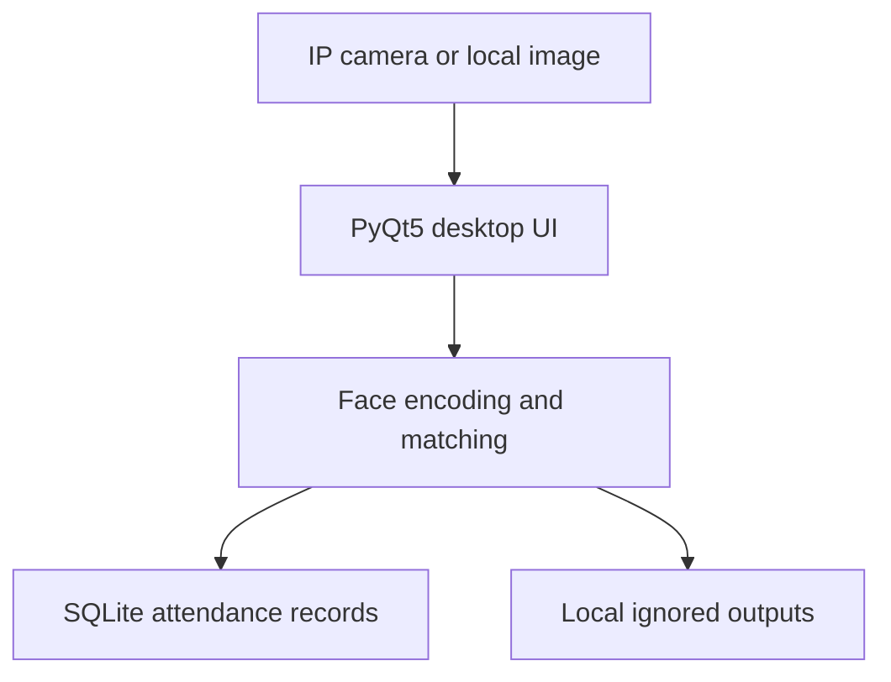

# Eqra Face System

A desktop face-recognition and attendance prototype for local images and IP-camera streams. The application uses a PyQt5 interface, `face_recognition` for face encodings and matching, OpenCV for camera frames, and SQLite for local attendance records.

> Project status: legacy portfolio prototype. It is suitable for demonstration, learning, and controlled experiments. It is not a production biometric security system.

## Main features

- Register a person from an image and store the face encoding locally.
- Detect known and unknown faces from images or IP-camera frames.
- Record attendance events in a local SQLite database.
- Search, review, update, and delete attendance records through the desktop UI.
- Import multiple local image records from CSV.
- Configure IP cameras through the UI.
- Optionally communicate with an Arduino or ESP8266 relay.
- Use the face-recognition module independently from the command line.

## System flow



## Privacy-safe public version

This repository intentionally excludes all real-person sample images and all runtime biometric data. It also excludes the populated database, face encodings, camera captures, recognition outputs, local credentials, device addresses, logs, third-party installers, compiled caches, and binary setup archives from the original project package.

The included `.gitignore` prevents these items from being added accidentally. Keep all test images outside the repository or under `data/private/`, which is ignored.

## Project structure

```text
EqraFaceSystem/
|-- .env.example                  # Local configuration template
|-- .gitignore                    # Privacy and build exclusions
|-- README.md                     # Project documentation
|-- requirements.txt              # Pinned legacy Python dependencies
|-- constraints.txt               # dlib version constraint
|-- app/
|   |-- UserInterface.py          # Main PyQt5 desktop application
|   |-- CapturePicture.py         # IP-camera still-image capture
|   |-- _IO.py                    # Environment-based configuration
|   |-- _IO_sqlite.py             # Default local database backend
|   |-- _IO_Mysql.py              # Optional legacy MySQL backend
|   |-- _User.py                  # User model
|   |-- _Cam.py                   # Camera model
|   |-- _AttendanceRecord.py      # Attendance model
|   |-- camera.jpeg               # Generic camera placeholder icon
|   |-- config/
|   |   |-- students.example.csv  # Synthetic CSV format example
|   |   `-- haarcascade_frontalface_default.xml
|   |-- face_ai/
|   |   |-- recognition.py        # Registration, detection, and deletion CLI
|   |   |-- haarcascade_frontalface_default.xml
|   |   |-- id_folder/            # Generated encodings, ignored
|   |   `-- do/                   # Temporary images, ignored
|   `-- _Output/                  # Generated captures, ignored
|-- docs/PRIVACY.md               # Biometric-data handling notes
`-- hardware/arduino/             # Sanitized optional relay examples
```

## Environment

The original application targets Python 3.7 on Windows. Its libraries are pinned to legacy versions for reproducibility. A newer Python version may require dependency and source updates, especially for `dlib`, `face-recognition`, and PyQt5.

### Recommended setup on Windows

From PowerShell or Command Prompt in the project root:

```powershell
py -3.7 -m venv .venv
.venv\Scripts\activate
python -m pip install --upgrade "pip==24.0" setuptools wheel
python -m pip install -r requirements.txt -c constraints.txt
copy .env.example .env
python app\UserInterface.py
```

If `dlib` cannot build, install the Microsoft C++ build tools or a trusted wheel that exactly matches Python 3.7 and your Windows architecture. Do not use the old installers or wheel that were bundled with the private project archive.

On Ubuntu, install the compiler toolchain, CMake, and Python development headers before installing the Python requirements. PyQt5 also requires a graphical desktop session.

## Configuration

Copy `.env.example` to `.env` and change only the local values you need. The `.env` file is ignored by Git. Runtime paths are resolved from the project rather than from a specific user's computer.

| Variable | Purpose | Default |
| --- | --- | --- |
| `EQRA_DB_PATH` | SQLite database location | `app/config/IPCam.db` |
| `EQRA_FACE_AI_TOLERANCE` | Face-matching tolerance used by the UI | `0.7` |
| `EQRA_FACE_AI_CPUS` | Legacy CPU setting passed by the UI | `1` |
| `EQRA_SERIAL_PORT` | Optional Arduino serial port, such as `COM3` | Disabled |
| `EQRA_SERIAL_BAUD_RATE` | Arduino serial baud rate | `9600` |
| `EQRA_RELAY_AUTHORIZED_IDS` | Comma-separated local user IDs allowed to trigger the relay | Empty |
| `EQRA_CAMERA_*` | Optional camera host, port, and credentials | Empty |
| `EQRA_MYSQL_*` | Optional MySQL backend settings | Local placeholders |

The default UI uses SQLite. Camera records entered through the UI are saved only in the ignored local database.

To experiment with the optional legacy MySQL module, install `requirements-mysql.txt` and review the backend code before enabling it:

```powershell
python -m pip install -r requirements-mysql.txt -c constraints.txt
```

## Face-recognition CLI

Use images stored outside the repository. The default face-encoding directory is `app/face_ai/id_folder/` and is ignored by Git.

Register a face:

```powershell
python app\face_ai\recognition.py --mode new --image_path "C:\private_faces\person_001.jpg" --id person_001 --cpu 1
```

Detect a face:

```powershell
python app\face_ai\recognition.py --mode detect --image_path "C:\private_faces\test.jpg" --tol 0.7 --cpu 1
```

Remove a stored encoding:

```powershell
python app\face_ai\recognition.py --mode del --id person_001
```

The CLI returns JSON. Example:

```json
{
  "data": [
    {
      "id": "person_001",
      "accuracy": 42.137,
      "tolerance": 0.7
    }
  ]
}
```

For compatibility with the original application, the field is still named `accuracy`. It is actually the closest face distance multiplied by 100, so a lower value means a closer match. It should not be interpreted as a calibrated probability.

## Local data and generated outputs

The application creates these items locally as needed:

- `app/config/IPCam.db`, users, camera settings, and attendance records.
- `app/face_ai/id_folder/*.txt`, biometric face encodings.
- `app/_Output/`, temporary, known, and unknown camera images.
- `app/csv.error.log`, CSV import errors.

These paths are intentionally excluded from version control. The repository is runnable without them, but recognition requires you to register at least one local face first.

## Limitations and responsible use

- Face recognition can produce false matches and missed detections.
- Performance can vary across lighting, pose, camera quality, age, and demographic groups.
- The local SQLite design stores camera credentials in plaintext. Use only disposable development credentials and never deploy this design unchanged.
- Face encodings are biometric data. Obtain informed consent, limit access, define retention periods, and follow applicable privacy laws and institutional policies.
- Do not use this prototype for high-stakes decisions, covert surveillance, or access control.

See [docs/PRIVACY.md](docs/PRIVACY.md) before working with real-person data.

## Publish this folder to GitHub

Extract the ZIP, open the `EqraFaceSystem` folder in VS Code, and publish it before adding any private images or a real `.env` file.

```bash
git init -b main
git status --short
git add -- .
git status --short
git commit -m "Publish privacy-safe Eqra Face System"
git remote add origin https://github.com/YOUR_USERNAME/EqraFaceSystem.git
git push -u origin main
```

Review the second `git status --short` output before committing. It must not include face images, databases, encodings, credentials, logs, installers, or local output files. You can also use VS Code's Source Control panel and the **Publish Branch** action after `git init` and the first commit.

## Attribution and license

The original source contains an Eqra Tech Company all-rights-reserved notice, which has been retained. No separate open-source license is included in this repository. Confirm that you have the necessary rights before redistributing or relicensing the code.
